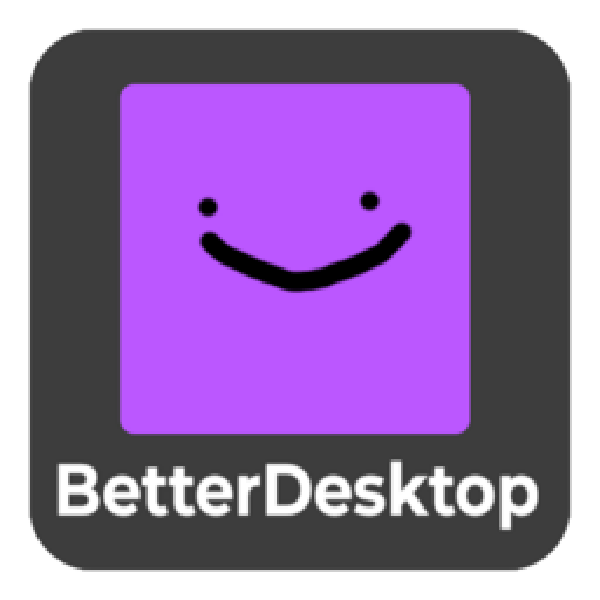
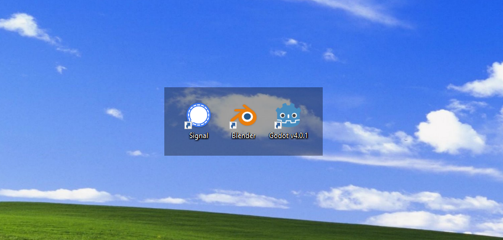
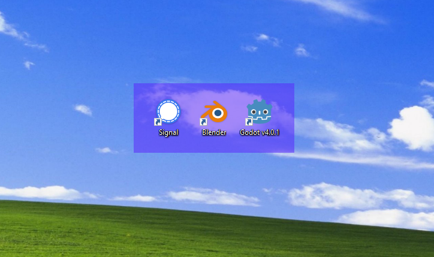
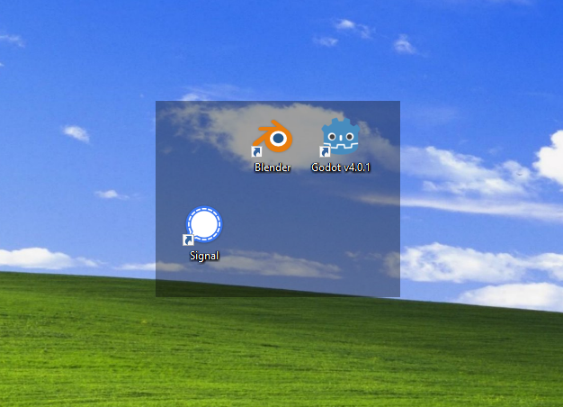
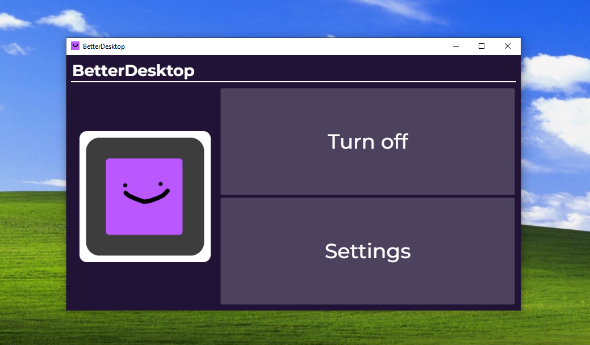

# BetterDesktop
Make your desktop icons stand out by adding a colored box beneath them!

## Why Should I Use BetterDesktop?
BetterDesktop was created to increase the contrast of the icons on your desktop.
Lost of people have known the feeling of finding the ✨perfect wallpaper✨, just to have it make the desktop icons hard to see.
That is why I created BetterDesktop!

## Features
- Render a colored box below desktop icons, making them pop out.
- Customize the box's color and alpha.
- Start the app on system startup.
- Group icons into neat rectangles for an organized look.
- Minimize to system tray on close.
- System tray icon to exit the app or show the window.
- Shift + exiting app with ❌ button will always quit the app, regardless of the system tray setting.

## Screenshots

## Platforms
BetterDesktop only supports Windows. It has been on windows 10 and 11. The app only works with a single monitor.

## License
    MIT License

    Copyright (c) 2023 Moonstone Studios

    Permission is hereby granted, free of charge, to any person obtaining a copy
    of this software and associated documentation files (the "Software"), to deal
    in the Software without restriction, including without limitation the rights
    to use, copy, modify, merge, publish, distribute, sublicense, and/or sell
    copies of the Software, and to permit persons to whom the Software is
    furnished to do so, subject to the following conditions:

    The above copyright notice and this permission notice shall be included in all
    copies or substantial portions of the Software.

    THE SOFTWARE IS PROVIDED "AS IS", WITHOUT WARRANTY OF ANY KIND, EXPRESS OR
    IMPLIED, INCLUDING BUT NOT LIMITED TO THE WARRANTIES OF MERCHANTABILITY,
    FITNESS FOR A PARTICULAR PURPOSE AND NONINFRINGEMENT. IN NO EVENT SHALL THE
    AUTHORS OR COPYRIGHT HOLDERS BE LIABLE FOR ANY CLAIM, DAMAGES OR OTHER
    LIABILITY, WHETHER IN AN ACTION OF CONTRACT, TORT OR OTHERWISE, ARISING FROM,
    OUT OF OR IN CONNECTION WITH THE SOFTWARE OR THE USE OR OTHER DEALINGS IN THE
    SOFTWARE.

## Open Source Licenses
See the [UsedCodeLicences.txt file](UsedCodeLicenses.txt) to see all of the open source code's licenses used in this app.